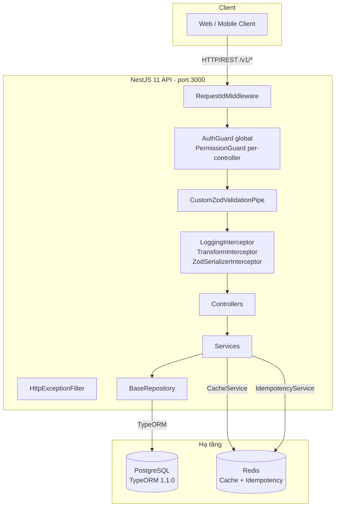
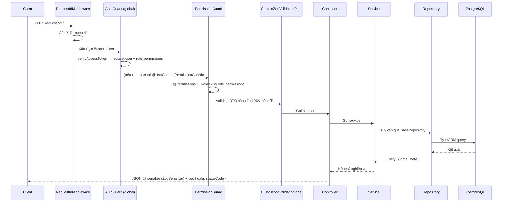
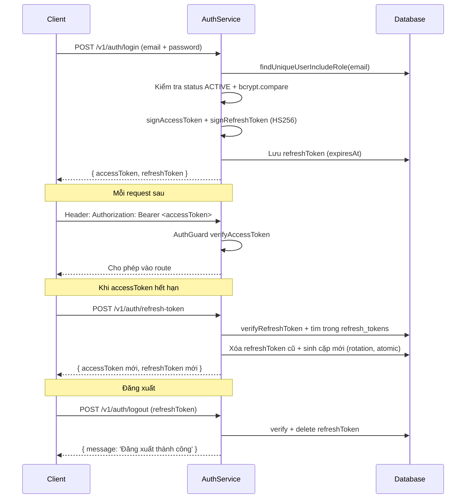
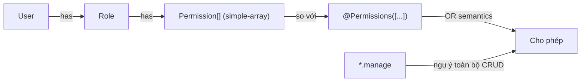
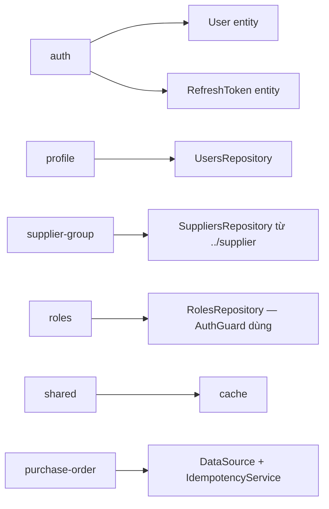

# Kiến trúc Backend — CRM FCVN

> Tài liệu mô tả kiến trúc tổng thể. Quy ước viết code chi tiết xem [CONVENTIONS.md](CONVENTIONS.md), tổng quan ngắn xem [AGENTS.md](../AGENTS.md).

## Tổng quan hệ thống



**Kiến trúc:** Monolith, feature-based modules. KHÔNG có microservice, WebSocket, queue (BullMQ/RabbitMQ), S3, payment gateway, i18n — đây là CRM nội bộ.

---

## Cấu trúc thư mục

```
src/
├── main.ts                              # Bootstrap: URI versioning v1, Swagger /api, pino logger
├── app.module.ts                        # Root module: global wiring (APP_*) + middleware
├── app.controller.ts / app.service.ts  # Health check
│
├── config/
│   └── swagger.config.ts                # Swagger "CRM FCVN API", Bearer auth, cleanupOpenApiDoc
│
├── database/
│   ├── database.module.ts               # TypeOrmModule.forRootAsync
│   ├── database.provider.ts             # postgres, autoLoadEntities, synchronize: false
│   ├── datasource-cli.ts                # DataSource cho TypeORM CLI (migration)
│   └── migrations/                      # AutoMigration<N> sinh tự động
│
├── docs/                                # migration.md, setup-report.md, CONVENTIONS.md, BE_ARCHITECTURE.md
│
├── modules/                             # Toàn bộ feature module
│   ├── auth/                            # Login, refresh-token rotation, logout
│   ├── cache/                           # @Global Redis cache (CacheService)
│   ├── customers/                       # CRUD + soft delete (module chuẩn mẫu)
│   ├── profile/                         # Profile user hiện tại (kèm role + permissions)
│   ├── purchase-order/                  # Tạo PO: idempotency + transaction
│   ├── purchase-order-item/             # Line item của PO (chỉ entity + model)
│   ├── refresh-token/                   # Lưu refresh token (không controller)
│   ├── roles/                           # Role CRUD, permissions simple-array, Redis cache
│   ├── supplier/                        # Supplier CRUD + deactivate
│   ├── supplier-group/                  # Group CRUD + changeStatus + assignSuppliers
│   └── users/                           # User CRUD, hash password, gán role
│
└── shared/                              # @Global() — cross-cutting infra
    ├── config.ts                        # Validate env bằng Zod (fail nhanh nếu thiếu/sai)
    ├── helpers.ts                       # isPostgresError, isUniqueConstraintError (23505)...
    ├── utils.ts                         # generateUserCode, generatePurchaseCode
    ├── shared.module.ts                 # Export HashingService, TokenService, IdempotencyService
    ├── constant/                        # auth, permission, customer, supplier, supplier-group, user
    ├── context/                         # RequestContextService — DEAD CODE, chưa wire
    ├── decorator/                       # @Public, @Permissions, @ActiveUser, @ApiPaginationQuery
    ├── dto/                             # PaginationQueryDTO, EmptyBodyDTO, MessageResDTO
    ├── entities/                        # BaseEntity (audit + soft delete)
    ├── filter/                          # HttpExceptionFilter
    ├── guard/                           # AuthGuard, PermissionGuard
    ├── interceptor/                     # Logging, Transform, Idempotent
    ├── middleware/                      # RequestIdMiddleware (X-Request-ID)
    ├── model/                           # SharedQuerySchema, PaginationQuerySchema, PaginationResSchema
    ├── pipe/                            # CustomZodValidationPipe (422)
    ├── repositories/                    # BaseRepository<T>
    ├── services/                        # HashingService, TokenService, IdempotencyService
    └── types/                           # jwt.type, request.type
```

---

## Global Wiring & Request Lifecycle

Global providers đăng ký trong `src/app.module.ts`:

| Token             | Class                      | Vai trò                             |
| ----------------- | -------------------------- | ----------------------------------- |
| `APP_PIPE`        | `CustomZodValidationPipe`  | Validate DTO bằng Zod → lỗi **422** |
| `APP_GUARD`       | `AuthGuard`                | Xác thực JWT Bearer toàn cục        |
| `APP_FILTER`      | `HttpExceptionFilter`      | Format lỗi JSON thống nhất          |
| `APP_INTERCEPTOR` | `LoggingInterceptor`       | Log `Before/After ... ms`           |
| `APP_INTERCEPTOR` | `TransformInterceptor`     | Bọc response `{ data, statusCode }` |
| `APP_INTERCEPTOR` | `ZodSerializerInterceptor` | Serialize response theo Zod schema  |

Middleware: `RequestIdMiddleware` áp dụng `forRoutes('*')` — đảm bảo mọi request có `X-Request-ID` (đọc từ header hoặc sinh `randomUUID`, set lại vào response header).

Thứ tự interceptor: `Logging` → `Transform` → `Idempotency` → `ZodSerializer`.



### Trách nhiệm từng tầng

| Tầng        | Trách nhiệm                                                 |
| ----------- | ----------------------------------------------------------- |
| Middleware  | Gán X-Request-ID cho mọi request                            |
| Guard       | `AuthGuard` xác thực JWT; `PermissionGuard` kiểm tra RBAC   |
| Interceptor | Logging, bọc response chuẩn, serialize Zod                  |
| Filter      | Bắt mọi exception, trả `{ statusCode, error, message }`     |
| Pipe        | Validate & transform DTO bằng Zod (422)                     |
| Controller  | Routing, extract param, gọi service — KHÔNG logic nghiệp vụ |
| Service     | Logic nghiệp vụ, transaction (PO), idempotency              |
| Repository  | Truy cập DB qua `BaseRepository` — không logic nghiệp vụ    |

### Response & Error shape

```ts
// Thường
{
  (data, statusCode);
}

// Phân trang (data là array + có meta)
{
  (data, meta, statusCode);
} // meta: { total, page, limit, totalPages }

// Lỗi (HttpExceptionFilter)
{
  (statusCode, error, message);
} // message: string | string[]
```

---

## Giải phẫu một feature module

Module chuẩn mẫu: `src/modules/customers/` — CRUD + soft delete.

```
modules/customers/
├── customer.entity.ts             # TypeORM entity (extends BaseEntity)
├── customer.model.ts              # Zod schema + inferred types (KHÔNG class)
├── customer.dto.ts                # createZodDto wrapper cho controller/Swagger
├── customers.repository.ts        # extends BaseRepository<Customer>
├── customers.service.ts           # create/findAll/findOne/update/remove
├── customers.controller.ts        # @Controller('customers')
├── customers.module.ts            # forFeature([Customer]) + providers + exports
└── customers.service.spec.ts      # unit test
```

- Entity `extends BaseEntity` → tự có `createdAt/updatedAt/deletedAt` + `*ById` audit.
- Model (Zod) là nguồn sự thật của contract API; DTO chỉ là wrapper.
- Service set `createdById`/`updatedById`; bắt `isUniqueConstraintError` → `ConflictException`.
- Controller dùng `@Permissions([...])`, `@ActiveUser('userId')`, `@ZodSerializerDto(...)`.
- Ngoại lệ: `purchase-order` **không dùng repository** — gọi `DataSource.transaction()` trực tiếp; `auth.repository.ts` không extend `BaseRepository`.

---

## Mô hình xác thực (Auth)



**Điểm chú ý:**

- Payload access token: `{ userId, roleId, roleName }` + claim `uuid` ngẫu nhiên.
- Refresh token lưu trong bảng `refresh_tokens` (entity `RefreshToken extends BaseEntity`, `@Index(['expiresAt'])`).
- **Rotation**: mỗi lần refresh, token cũ bị xóa và sinh cặp mới — dùng `Promise.all([delete, generate])` đảm bảo atomic.
- Replay detection: nếu token cũ được dùng lại sau khi đã xoay → `isUniqueConstraintError` → `UnauthorizedException('Refresh Token đã được sử dụng')`.
- Không có 2FA, không có OAuth, không có device bảng — refresh token gắn trực tiếp với user.

---

## Phân quyền (RBAC)



- `AuthGuard` (global): xác thực JWT → load `RolesRepository.findOne(payload.roleId)` → gán `request['user']` + `request['role_permissions']`.
- `PermissionGuard` (per-controller `@UseGuards`): đọc `@Permissions([...])`, kiểm tra OR; `*.manage` ngụ ý CRUD module đó (xem `MANAGE_PERMISSIONS`).
- Enum `Permission` dạng `{resource}.{action}` (`user.read`, `supplier.changeStatus`, `purchaseOrder.create`, ...) trong `src/shared/constant/permission.constant.ts`.
- Route public: `@Public()` (chỉ auth login).

---

## Caching (Redis)

- `AppCacheModule` (`@Global`): `CacheModule.register` với `Keyv` + `@keyv/redis` (URL `REDIS_URL`, default `redis://localhost:6379`).
- `CacheService` (`src/modules/cache/cache.service.ts`): `get<T>`, `set<T>`, `delete`, `clear`.
- Hiện được dùng bởi:
  - `RolesService.findAll` — cache danh sách role key `roles:list`.
  - `IdempotencyService` — cache response + lock.

---

## Idempotency

- Idempotency thực nằm ở **service layer**: `PurchaseOrderService.purchaseOrder(dto, idempotencyKey)` gọi `IdempotencyService` trực tiếp:
  - Client gửi header `idempotency-key` khi tạo PO.
  - `IdempotencyService` (Redis): response cache TTL **24h**, lock TTL **30s**, wait timeout **10s** (poll 200ms).
  - Flow: check response cache → check DB → acquire lock → transaction → save response → clear lock; bắt unique violation (23505) để trả response cũ.

---

## Giao tiếp giữa các module

- Không có layering chặt — module khác thường tự `TypeOrmModule.forFeature([...entity])` lại thay vì import module.
- Global modules (không cần import lại):
  - `SharedModule` (`@Global`) exports `HashingService`, `TokenService`, `IdempotencyService`; imports `JwtModule` + `AppCacheModule`.
  - `AppCacheModule` (`@Global`) exports `CacheService`.



---

## Cấu hình môi trường

Validate bằng Zod tại `src/shared/config.ts` — server **không khởi động** nếu thiếu/sai (`process.exit(1)`).

```bash
# Bắt buộc (z.string())
DB_DATABASE=...
DB_HOST=...
DB_PORT=5432            # không validate, default 5432
DB_USER=...             # KHÔNG phải DB_USERNAME
DB_PASSWORD=...
PORT=3000
ACCESS_TOKEN_SECRET=...
ACCESS_TOKEN_EXPIRES_IN=...
REFRESH_TOKEN_SECRET=...
REFRESH_TOKEN_EXPIRES_IN=...
IDEMPOTENCY_KEY=...     # bắt buộc nhưng thiếu trong .env.example

# Đọc trực tiếp từ process.env (không validate)
REDIS_URL=redis://localhost:6379
# Seed script
DB_ADMIN_PASSWORD_TEST=...
DB_SALES_PASSWORD_TEST=...
```

> ⚠️ Discrepancy: README ghi `DB_USERNAME` nhưng code dùng `DB_USER`; `DB_SYNC`/`REDIS_TTL` có trong `.env.example` nhưng không được đọc.

---

## Khởi động (main.ts)

```typescript
async function bootstrap() {
  const app = await NestFactory.create(AppModule, { bufferLogs: true });
  app.enableVersioning({ type: VersioningType.URI, defaultVersion: '1' }); // /v1/*
  configureSwaggerUI(app); // Swagger tại /api
  app.useLogger(app.get(Logger)); // pino logger
  await app.listen(process.env.PORT ?? 3000);
}
```

- **URI versioning**: mọi route phục vụ dưới `/v1/...`; controller không khai báo version.
- **Swagger**: title "CRM FCVN API", Bearer auth, chạy `cleanupOpenApiDoc` (nestjs-zod).
- Không CORS/helmet/static/websocket/microservice — API thuần JSON cho client nội bộ.

---

## Database & Migrations

- `database.provider.ts`: `type: postgres`, `autoLoadEntities: true`, `synchronize: false` (hardcoded), `logging: true`.
- `datasource-cli.ts`: DataSource cho TypeORM CLI (`migrations: src/database/migrations/*.ts`).
- Migrations sinh tự động (`AutoMigration<N>`); bảng gốc `users`, `roles`, `customers`, `refresh_tokens` tồn tại trước (không thuộc migration nào).
- Quy trình: sửa entity → `npm run migration:generate` → review → `npm run migration:run` → verify → `migration:revert` nếu cần. Chi tiết: [migration.md](migration.md).
- Seed thủ công: `npx ts-node initScript/create-role.ts` → `create-user.ts` → `create-customer.ts` (10k khách hàng mẫu).

---

## Quy ước code (tóm tắt)

| Hạng mục    | Quy ước                                                                                           |
| ----------- | ------------------------------------------------------------------------------------------------- |
| Validation  | Zod v4 qua `nestjs-zod` — KHÔNG class-validator                                                   |
| DTO         | `createZodDto(Schema)`; `CreateXxxBodyDTO`, `UpdateXxxBodyDTO`, `GetXxxQueryDTO`, `GetXxxResDTO`  |
| Entity      | `extends BaseEntity` (audit + soft delete)                                                        |
| Repository  | `extends BaseRepository<T>`; `findAll` array vs `{ data, meta }`                                  |
| Response    | `{ data, statusCode }` / `{ data, meta, statusCode }` (TransformInterceptor)                      |
| Xóa dữ liệu | Soft delete: `deletedAt` + `deletedById`                                                          |
| Audit trail | `createdById`, `updatedById`, `deletedById` trên mọi entity                                       |
| Lỗi         | `ConflictException`/`NotFoundException`/`UnauthorizedException`; helper `isUniqueConstraintError` |
| Schema DB   | Sửa entity → migration (KHÔNG `synchronize: true`)                                                |
| Ngôn ngữ    | Mọi message/API summary bằng tiếng Việt                                                           |

Chi tiết đầy đủ: [CONVENTIONS.md](CONVENTIONS.md).

---

## Related Docs

- [AGENTS.md](../AGENTS.md) — tổng quan ngắn + commands + gotchas.
- [CONVENTIONS.md](CONVENTIONS.md) — quy ước code chi tiết từng tầng.
- [migration.md](migration.md) — quy trình migration TypeORM.
- [setup-report.md](setup-report.md) — các lỗi setup đã gặp + cách xử lý.
