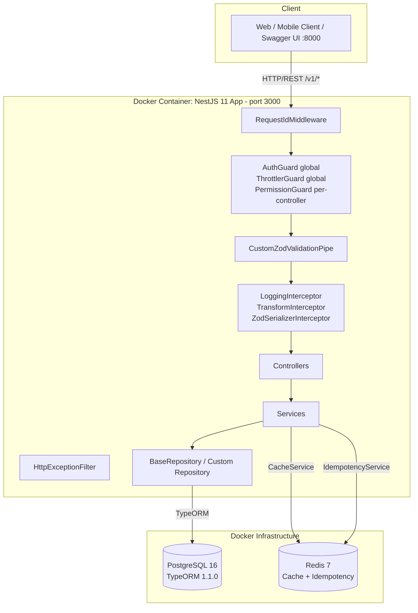
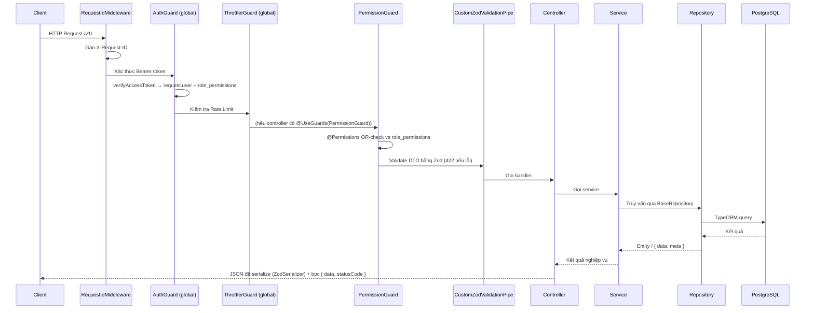
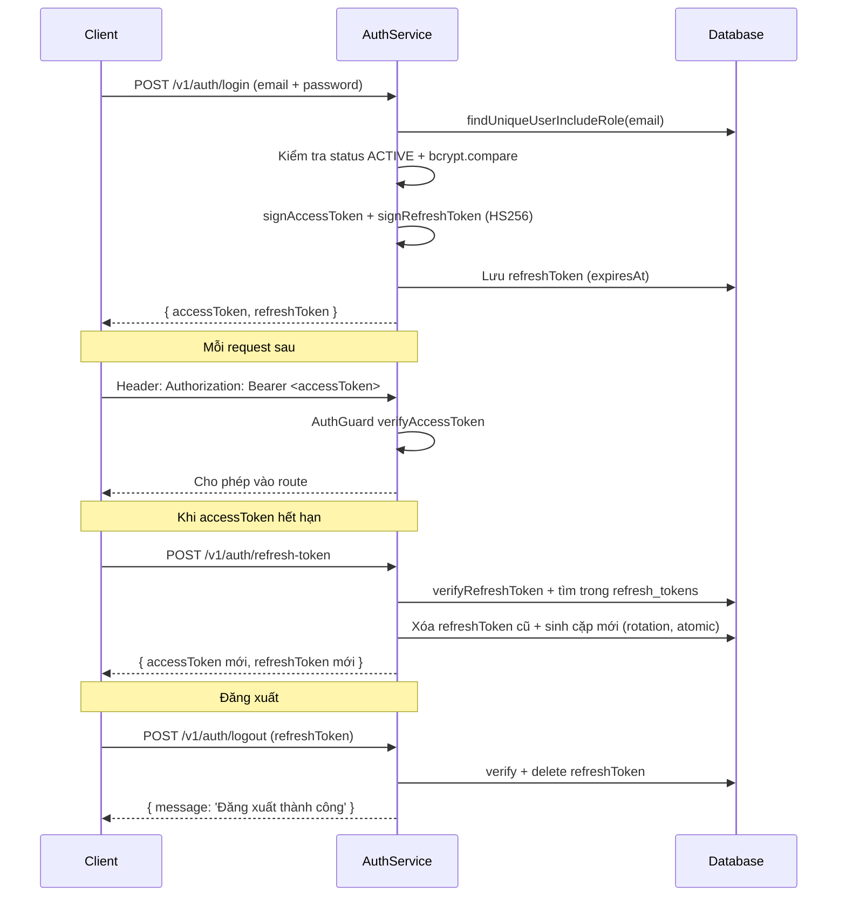
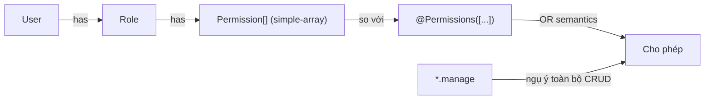

# Kiến trúc Backend — CRM FCVN

> Tài liệu mô tả kiến trúc tổng thể. Quy ước viết code chi tiết xem [CONVENTIONS.md](CONVENTIONS.md), tổng quan ngắn xem [AGENTS.md](../AGENTS.md).

## Tổng quan hệ thống



**Kiến trúc:** Monolith, feature-based modules. Containerized bằng Docker Multi-stage build + Docker Compose (App, PostgreSQL 16, Redis 7).

---

## Cấu trúc thư mục

```
.
├── Dockerfile                           # Multi-stage Docker build (base, development, build, production)
├── docker-compose.yml                   # Docker Compose dev (App :8000->3000, Postgres :5432, Redis :6379)
├── docker-compose.prod.yml              # Docker Compose production override
├── .dockerignore                        # Loại trừ node_modules, dist, .git, .env khỏi Docker context
├── initScript/                          # Seed scripts (create-role, create-department, create-user, create-customer, seed-all)
└── src/
    ├── main.ts                          # Bootstrap: URI versioning v1, Swagger /api, pino logger, helmet, cors
    ├── app.module.ts                    # Root module: global wiring (APP_*) + middleware
    ├── app.controller.ts / app.service.ts # Health check
    │
    ├── config/
    │   └── swagger.config.ts            # Swagger "CRM FCVN API", Bearer auth, cleanupOpenApiDoc
    │
    ├── database/
    │   ├── database.module.ts           # TypeOrmModule.forRootAsync
    │   ├── database.provider.ts         # postgres, autoLoadEntities, synchronize: false
    │   ├── datasource-cli.ts            # DataSource cho TypeORM CLI (migration)
    │   └── migrations/                  # AutoMigration<N> sinh tự động từ TypeORM
    │
    ├── docs/                            # migration.md, setup-report.md, CONVENTIONS.md, BE_ARCHITECTURE.md
    │
    ├── modules/                         # Toàn bộ 13 feature modules
    │   ├── auth/                        # Login, refresh-token rotation, logout, rate limit 5 req/min
    │   ├── cache/                       # @Global Redis cache (CacheService)
    │   ├── customers/                   # CRUD + soft delete (module chuẩn mẫu CRUD)
    │   ├── departments/                 # Quản lý phòng ban (liên kết User & Purchase Request)
    │   ├── profile/                     # Profile user hiện tại (kèm role + permissions + department)
    │   ├── purchase-order/              # Tạo PO: idempotency + transaction
    │   ├── purchase-order-item/         # Line item của PO (chỉ entity + model)
    │   ├── purchase-request/            # Workflow Đề nghị mua hàng (DRAFT -> PENDING_APPROVAL -> APPROVED / REJECTED)
    │   ├── refresh-token/               # Lưu refresh token (không controller)
    │   ├── roles/                       # Role CRUD, permissions simple-array, Redis cache
    │   ├── supplier/                    # Supplier CRUD + deactivate
    │   ├── supplier-group/              # Group CRUD + changeStatus + assignSuppliers
    │   └── users/                       # User CRUD, hash password, gán role, gán phòng ban
    │
    └── shared/                          # @Global() — cross-cutting infra
        ├── config.ts                    # Validate env bằng Zod (fail nhanh nếu thiếu/sai)
        ├── helpers.ts                   # isPostgresError, isUniqueConstraintError (23505)...
        ├── utils.ts                     # generateUserCode, generatePurchaseCode
        ├── shared.module.ts             # Export HashingService, TokenService, IdempotencyService
        ├── constant/                    # auth, permission, customer, department, purchase-request, supplier, supplier-group, user
        ├── context/                     # RequestContextService — DEAD CODE, chưa wire
        ├── decorator/                   # @Public, @Permissions, @ActiveUser, @ActiveUserPermissions, @ApiPaginationQuery
        ├── dto/                         # PaginationQueryDTO, EmptyBodyDTO, MessageResDTO
        ├── entities/                    # BaseEntity (audit + soft delete)
        ├── filter/                      # HttpExceptionFilter
        ├── guard/                       # AuthGuard, PermissionGuard
        ├── interceptor/                 # Logging, Transform, Idempotent
        ├── middleware/                  # RequestIdMiddleware (X-Request-ID)
        ├── model/                       # SharedQuerySchema, PaginationQuerySchema, PaginationResSchema
        ├── pipe/                        # CustomZodValidationPipe (422)
        ├── repositories/                # BaseRepository<T>
        ├── services/                    # HashingService, TokenService, IdempotencyService
        └── types/                       # jwt.type, request.type
```

---

## Global Wiring & Request Lifecycle

Global providers đăng ký trong `src/app.module.ts`:

| Token             | Class                      | Vai trò                             |
| ----------------- | -------------------------- | ----------------------------------- |
| `APP_PIPE`        | `CustomZodValidationPipe`  | Validate DTO bằng Zod → lỗi **422** |
| `APP_GUARD`       | `AuthGuard`                | Xác thực JWT Bearer toàn cục        |
| `APP_GUARD`       | `ThrottlerGuard`           | Giới hạn tần suất gọi API (5 req/m) |
| `APP_FILTER`      | `HttpExceptionFilter`      | Format lỗi JSON thống nhất          |
| `APP_INTERCEPTOR` | `LoggingInterceptor`       | Log `Before/After ... ms`           |
| `APP_INTERCEPTOR` | `TransformInterceptor`     | Bọc response `{ data, statusCode }` |
| `APP_INTERCEPTOR` | `ZodSerializerInterceptor` | Serialize response theo Zod schema  |

Middleware: `RequestIdMiddleware` áp dụng `forRoutes('*')` — đảm bảo mọi request có `X-Request-ID` (đọc từ header hoặc sinh `randomUUID`, set lại vào response header).

Thứ tự guard: `AuthGuard` → `ThrottlerGuard` → `PermissionGuard` (per-controller).
Thứ tự interceptor: `Logging` → `Transform` → `Idempotency` → `ZodSerializer`.



### Trách nhiệm từng tầng

| Tầng        | Trách nhiệm                                                 |
| ----------- | ----------------------------------------------------------- |
| Middleware  | Gán X-Request-ID cho mọi request                            |
| Guard       | `AuthGuard` xác thực JWT; `PermissionGuard` kiểm tra RBAC   |
| Interceptor | Logging, bọc response chuẩn, serialize Zod                  |
| Filter      | Bắt mọi exception, trả `{ statusCode, error, message }`     |
| Pipe        | Validate & transform DTO bằng Zod (422)                     |
| Controller  | Routing, extract param, gọi service — KHÔNG logic nghiệp vụ |
| Service     | Logic nghiệp vụ, transaction (PO), workflow (PR)            |
| Repository  | Truy cập DB qua `BaseRepository` — không logic nghiệp vụ    |

### Response & Error shape

```ts
// Thường
{
  data: any,
  statusCode: number
}

// Phân trang (data là array + có meta)
{
  data: any[],
  meta: {
    total: number,
    page: number,
    limit: number,
    totalPages: number
  },
  statusCode: number
}

// Lỗi (HttpExceptionFilter)
{
  statusCode: number,
  error: string,
  message: string | string[]
}
```

---

## Feature Modules & Workflow Patterns

### 1. Module chuẩn CRUD: `src/modules/customers/`
Module chuẩn mẫu để tham chiếu pattern CRUD + soft delete:
- Entity `extends BaseEntity` (audit + soft delete).
- Repository kế thừa `BaseRepository<Customer>`.
- Controller đầy đủ Swagger decorators (`@ApiPaginationQuery()`, `@ApiQuery()`, `@ZodSerializerDto()`).

### 2. Module Workflow & State Machine: `src/modules/purchase-request/`
Module quản lý quy trình phê duyệt Đề nghị mua hàng (Purchase Request):
- **Trạng thái:** `DRAFT` ➔ `PENDING_APPROVAL` ➔ `APPROVED` / `REJECTED`.
- **Phân quyền theo phòng ban:** `DEPARTMENT_MANAGER` chỉ được duyệt PR thuộc phòng ban của mình; `BOD`/`MASTER` duyệt toàn hệ thống.
- **Audit Trail & Lịch sử:** Lưu vết mỗi lần chuyển trạng thái vào bảng `purchase_request_histories` (kèm `fromStatus`, `toStatus`, `action`, `reason`, `changedById`, `changedAt`).
- **Line Items:** Quản lý danh sách mặt hàng cần mua (`PurchaseRequestItem`), tự động tính `totalAmount` khi tạo/cập nhật.

### 3. Module Transaction & Idempotency: `src/modules/purchase-order/`
- Không dùng repository — dùng `DataSource.transaction()` trực tiếp để đảm bảo tính toàn vẹn khi tạo Purchase Order và Order Items.
- Tích hợp `IdempotencyService` lưu lock và response vào Redis (TTL 24h) chống duplicate request.

---

## Mô hình xác thực (Auth)



**Điểm chú ý:**
- Payload access token: `{ userId, roleId, roleName, departmentId? }` + claim `uuid` ngẫu nhiên.
- Refresh token lưu trong bảng `refresh_tokens` (entity `RefreshToken extends BaseEntity`, `@Index(['expiresAt'])`).
- **Rotation**: Mỗi lần refresh, token cũ bị xóa và sinh cặp mới — dùng `Promise.all([delete, generate])` đảm bảo atomic.
- Replay detection: Nếu token cũ được dùng lại sau khi đã xoay → `isUniqueConstraintError` → `UnauthorizedException('Refresh Token đã được sử dụng')`.

---

## Phân quyền (RBAC)



- `AuthGuard` (global): xác thực JWT → load `RolesRepository.findOne(payload.roleId)` → gán `request['user']` + `request['role_permissions']`.
- `PermissionGuard` (per-controller `@UseGuards`): đọc `@Permissions([...])`, kiểm tra OR; `*.manage` ngụ ý CRUD module đó (xem `MANAGE_PERMISSIONS`).
- Enum `Permission` dạng `{resource}.{action}` (`user.read`, `purchaseRequest.approve`, `supplier.changeStatus`, ...) trong `src/shared/constant/permission.constant.ts`.
- Route public: `@Public()` (cho auth login, refresh token).

---

## Caching & Idempotency (Redis)

- `AppCacheModule` (`@Global`): `CacheModule.register` với `Keyv` + `@keyv/redis` (URL `REDIS_URL`, default `redis://localhost:6379`).
- `CacheService` (`src/modules/cache/cache.service.ts`): `get<T>`, `set<T>`, `delete`, `clear`.
- `IdempotencyService` (Redis): Response cache TTL **24h**, lock TTL **30s**, wait timeout **10s** (poll 200ms).

---

## Database & Migrations

- `database.provider.ts`: `type: postgres`, `autoLoadEntities: true`, `synchronize: false` (hardcoded), `logging: true`.
- `datasource-cli.ts`: DataSource cho TypeORM CLI (`migrations: src/database/migrations/*.ts`).
- Danh sách Entities hiện có:
  - `users`, `roles`, `departments`
  - `customers`
  - `suppliers`, `supplier_groups`
  - `purchase_orders`, `purchase_order_items`
  - `purchase_requests`, `purchase_request_items`, `purchase_request_histories`
  - `refresh_tokens`
- Quy trình chuẩn: Sửa entity → `npm run migration:generate` → Review → `npm run migration:run`. Chi tiết: [migration.md](migration.md).
- Seed tự động: `npm run migration:init-db` (chạy migration và toàn bộ seed qua `initScript/seed-all.ts`).

---

## Docker & Containerization

Hệ thống được đóng gói hoàn chỉnh bằng Docker:
- **`Dockerfile` (Multi-stage build):**
  - `base`: Alpine + build tools (`python3`, `make`, `g++` cho native modules như `bcrypt`) + `npm ci`.
  - `development`: Mount source code, chạy dev server watch (`npm run start:dev`).
  - `build`: Biên dịch TypeScript và prune `node_modules` (`npm prune --omit=dev`).
  - `production`: Chạy runtime tối giản dưới quyền `USER node`.
- **`docker-compose.yml`:**
  - `app`: Port forwarding `${PORT:-8000}:3000`.
  - `postgres`: PostgreSQL 16 (Healthcheck qua `pg_isready`, persistent volume `crm_postgres_data`).
  - `redis`: Redis 7 (Healthcheck qua `redis-cli ping`, persistent volume `crm_redis_data`).
  - App phụ thuộc vào Postgres và Redis với điều kiện `service_healthy`.

---

## Quy ước code (tóm tắt)

| Hạng mục    | Quy ước                                                                                           |
| ----------- | ------------------------------------------------------------------------------------------------- |
| Validation  | Zod v4 qua `nestjs-zod` — KHÔNG class-validator                                                   |
| DTO         | `createZodDto(Schema)`; `CreateXxxBodyDTO`, `UpdateXxxBodyDTO`, `GetXxxQueryDTO`, `GetXxxResDTO`  |
| Query DTO   | Dùng TS Type từ `z.infer` trong `@Query(new ZodValidationPipe(Schema))` — KHÔNG dùng DTO class    |
| Swagger     | Dùng `@ApiPaginationQuery()` cho phân trang, `@ApiQuery()` cho filter riêng lẻ                    |
| Entity      | `extends BaseEntity` (audit + soft delete)                                                        |
| Repository  | `extends BaseRepository<T>`; `findAll` array vs `{ data, meta }`                                  |
| Response    | `{ data, statusCode }` / `{ data, meta, statusCode }` (TransformInterceptor)                      |
| Xóa dữ liệu | Soft delete: `deletedAt` + `deletedById`                                                          |
| Audit trail | `createdById`, `updatedById`, `deletedById` trên mọi entity                                       |
| Lỗi         | `ConflictException`/`NotFoundException`/`UnauthorizedException`; helper `isUniqueConstraintError` |
| Schema DB   | Sửa entity → migration (KHÔNG `synchronize: true`)                                                |
| Ngôn ngữ    | Mọi message/API summary bằng tiếng Việt                                                           |

Chi tiết đầy đủ: [CONVENTIONS.md](CONVENTIONS.md).

---

## Related Docs

- [AGENTS.md](../AGENTS.md) — tổng quan ngắn + commands + gotchas.
- [CONVENTIONS.md](CONVENTIONS.md) — quy ước code chi tiết từng tầng.
- [migration.md](migration.md) — quy trình migration TypeORM.
- [setup-report.md](setup-report.md) — các lỗi setup đã gặp + cách xử lý.
- [README.md](../README.md) — hướng dẫn khởi chạy nhanh Docker và xử lý edge cases.
